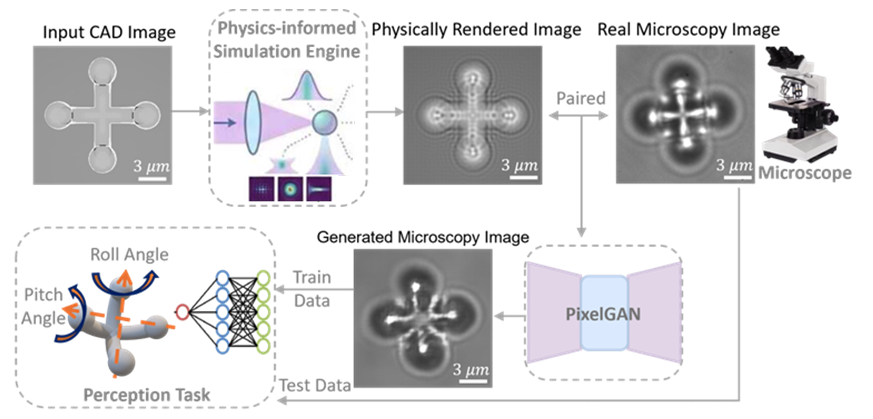
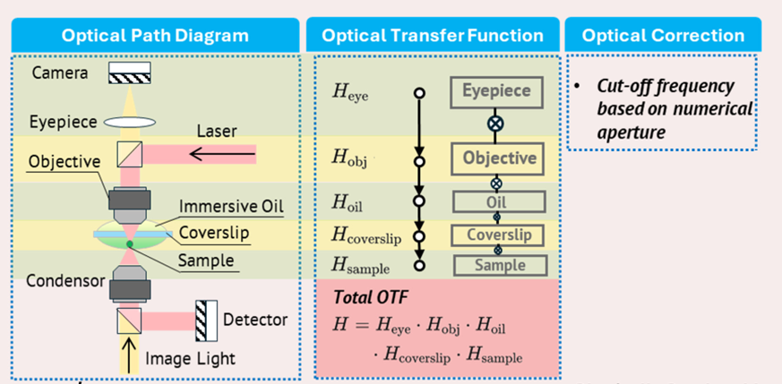

# Physics-Informed Machine Learning for Efficient Sim-to-Real Data Augmentation in Micro-Object Pose Estimation

<p align="center">
  <a href="paper/ICRA_Camera_Ready_Paper.pdf"></a>
  <a href="https://icra2026-sim2real.pages.dev/"></a>
  <a href="https://drive.google.com/file/d/15e_fGXoFKoTbZ8MBuWi562OZnGm-TVn2/view?usp=sharing"></a>
</p>

<p align="center"><strong>Zongcai Tan</strong>, <strong>Lan Wei</strong>, <strong>Dandan Zhang</strong></p>
<p align="center">Imperial College London</p>

This repository contains our ICRA 2026 pipeline for **physics-informed sim-to-real microscopy image generation** and **micro-object pose estimation**. We start from CAD images and depth cues, render microscopy-style images with a wave-optics-inspired simulation engine, align the rendered and experimental image sequences, refine the rendered images with PixelGAN, and finally use the generated data for downstream **pitch / roll pose estimation**.

<p align="center">
  
</p>

At a glance, the codebase is organised around four connected stages:

**CAD / depth cues** → **physics-informed rendering** → **paired sim-to-real translation with PixelGAN** → **pose-estimation training on generated and hybrid datasets**

---

## 🧭 Pipeline and files

### 1. Physics-informed rendering — `rendering_imge_generate.ipynb`

This notebook is the entry point of the simulation side of the pipeline. Its core function, `render_image_at_depth_gpu(...)`, takes a cropped CAD image and propagates it through a microscope-inspired frequency-domain model to produce microscopy-like rendered images across depth.

In code, the logic is:

**input CAD image**  
→ grayscale conversion and centre crop  
→ frequency grids `U, V`  
→ optical transfer terms `H_obj`, `H_eye`, `H_oil`, `H_coverslip`, `H_sample`  
→ combined transfer model `H`  
→ NA cutoff  
→ zero-padding + FFT propagation  
→ intensity reconstruction  
→ rendered image stack over `dz`

The current public notebook therefore covers the rendering backbone that matters for the sim-to-real pipeline: microscope-related transfer modelling, depth-aware propagation, and NA-limited image formation.

<p align="center">
  
</p>

A few variable names that are useful when reading the notebook:

- `dz`: the depth sweep used to generate the rendered stack
- `crop_size`: the spatial crop for the object region
- `lambda_`, `NA`, `f_obj`, `f_eye`, `pixel_size`: microscope parameters
- `render_image_at_depth_gpu(...)`: the main rendering function
- `output_folder`: where the rendered images are saved

For a more detailed walkthrough of this module, see [`docs/physics_rendering.md`](docs/physics_rendering.md).

---

### 2. Depth-aware pairing and dataset export — `Processing_image.ipynb`

This notebook connects the rendering stage to the GAN and pose-estimation stages. It reads the experimental microscopy images, the rendered images, and the kinematic metadata, and then builds the paired datasets used later in the pipeline.

The logic is:

**experimental sequence + rendered sequence + kinematics**  
→ resize / grayscale preprocessing  
→ focus-feature extraction  
→ LoG-based peak detection  
→ segment-wise alignment and balancing  
→ one-to-one rendered / experimental pairing  
→ export paired images for PixelGAN  
→ split outputs for pose-estimation experiments

The most important code blocks are:

- `process_gray_frame(...)`: image preprocessing for focus analysis
- `laplacian_of_gaussian(...)`: the main focus cue used for alignment
- `find_peaks(...)`: peak detection on the focus curves
- the dataset-export blocks that create:
  - `Pix2Pix_All`
  - `Gen_Model_All`
  - `Gen_Model_Part`
  - `Pose_Model/Experiment_*`
  - `Pose_Model/Generated_*`

This stage is what makes the later GAN training meaningful: the model is trained on *paired* rendered / experimental images instead of unrelated image pairs.

<p align="center">
  
</p>

---

### 3. PixelGAN sim-to-real translation — `train.py`, `test.py`, `models/`, `data/`, `options/`

Once the paired dataset has been exported, we train PixelGAN in paired image-to-image translation mode. The training / testing scripts follow the standard pix2pix / CycleGAN project structure, while the data used here are specific to our microscopy pipeline.

Typical training command:

```bash
python train.py \
  --checkpoints_dir ./checkpoints \
  --dataroot ./YOUR_PAIRED_DATASET \
  --name PixGAN \
  --model pix2pix \
  --netG unet_256 \
  --gan_mode lsgan \
  --batch_size 128 \
  --gpu_ids 0
```

Typical inference command:

```bash
python test.py \
  --dataroot ./YOUR_PAIRED_DATASET \
  --name PixGAN \
  --model pix2pix \
  --netG unet_256 \
  --gpu_ids 0
```

In this repository, the role of PixelGAN is very specific: it does **not** replace the rendering stage. Instead, it takes the rendered microscopy image as input and learns the remaining appearance gap to the real microscope image.

---

### 4. Pose estimation and hybrid-data experiments — `Pose_Model.py`, `Pose_Model_Train.py`, `create_hybrid_data.py`, `Pose_model_Train_Hybrid.py`

After image translation, we use the generated data for downstream pose estimation.

#### `Pose_Model.py`
This file defines the pose-estimation backbones. The models share the same task structure: one head predicts **pitch**, and one head predicts **roll**.

The current repository includes:

- `CNN3`
- `VGG`
- `Resnet18`
- `Resnet50`
- `VisionTransformer`

#### `Pose_Model_Train.py`
This script trains a pose-estimation model on a selected dataset such as `Experiment_All`, `Generated_All`, or `Generated_Part`. The file reads image names, parses pose labels from the `Pxx_Ryy` naming convention, builds class mappings for pitch and roll, and then trains / validates / tests the chosen backbone.

Typical usage:

```bash
python Pose_Model_Train.py
```

#### `create_hybrid_data.py`
This script mixes experimental and generated images by pose category to create hybrid training sets. The current script builds:

- `75% Exp + 25% Gen`
- `50% Exp + 50% Gen`
- `25% Exp + 75% Gen`

Each image is tagged as `exp_...` or `gen_...`, and sampling is performed class by class to preserve pose coverage.

Typical usage:

```bash
python create_hybrid_data.py
```

#### `Pose_model_Train_Hybrid.py`
This script trains the pose estimator on the hybrid datasets produced by `create_hybrid_data.py`.

Typical usage:

```bash
python Pose_model_Train_Hybrid.py
```

---

## ⚙️ Environment and paths

We recommend creating a fresh conda environment first:

```bash
conda env create -f environment.yml
conda activate pytorch-CycleGAN-and-pix2pix
```

The paper reports experiments with:

- Python 3.8
- PyTorch 1.8.1
- CUDA 11.4
- 1 × NVIDIA A100 80 GB

Before running the code, please update the placeholder paths in the notebooks / scripts, especially entries such as:

- `./xxx/...`
- `./Lan_Data/...`
- `./Lan_checkpoints_pose/...`

These placeholders are simply local path templates and should be replaced with your own directory layout.

---

## 🚀 Recommended running order

If you want to reproduce the full pipeline, the cleanest order is:

1. `rendering_imge_generate.ipynb`
2. `Processing_image.ipynb`
3. `train.py`
4. `test.py`
5. `Pose_Model_Train.py`
6. `create_hybrid_data.py`
7. `Pose_model_Train_Hybrid.py`

---

## 📁 Repository structure

```text
Micro_Object_Sim2Real-main/
├── README.md
├── environment.yml
├── rendering_imge_generate.ipynb
├── Processing_image.ipynb
├── train.py
├── test.py
├── Pose_Model.py
├── Pose_Model_Train.py
├── Pose_model_Train_Hybrid.py
├── create_hybrid_data.py
├── assets/
│   ├── method_overview.png
│   ├── physics_pipeline.png
│   └── adaptation_demo.gif
├── docs/
│   └── physics_rendering.md
├── paper/
│   └── ICRA2026_Micro_Object_Sim2Real.pdf
├── data/
├── datasets/
├── models/
├── options/
└── util/
```

---

## 📚 Citation

If you find this repository useful, please cite:

```bibtex
@article{tan2025physics,
  title={Physics-Informed Machine Learning for Efficient Sim-to-Real Data Augmentation in Micro-Object Pose Estimation},
  author={Tan, Zongcai and Wei, Lan and Zhang, Dandan},
  journal={arXiv preprint arXiv:2511.16494},
  year={2025}
}
```
