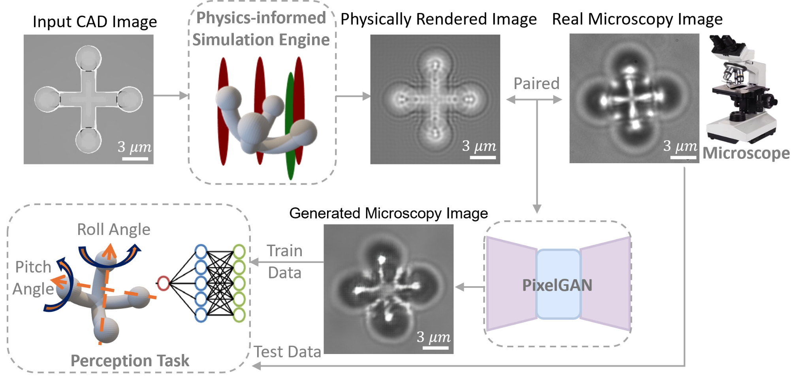

# Physics rendering walkthrough

This document explains how the rendering notebook is organised from the perspective of the **actual code flow** in `rendering_imge_generate.ipynb`.

## 1. What this notebook does

The notebook converts CAD-style object images into microscopy-like rendered images that already contain depth-dependent optical appearance. These rendered images are then paired with experimental microscopy images and passed to PixelGAN for further sim-to-real refinement.

In other words, this module is not a generic image filter. It is the **front end of the whole data-generation pipeline**.

---

## 2. Main code entry point

The key function is:

```python
render_image_at_depth_gpu(...)
```

This function takes the input image together with the optical parameters and returns the rendered intensity image at a chosen depth.

At a high level, the code follows this sequence:

**CAD image**  
→ **grayscale conversion / crop**  
→ **frequency coordinates `U, V`**  
→ **optical transfer terms**  
→ **combined transfer function `H`**  
→ **NA cutoff**  
→ **zero-padding**  
→ **FFT propagation**  
→ **intensity image**

---

## 3. Optical terms in the notebook

Inside `render_image_at_depth_gpu(...)`, the notebook explicitly constructs several transfer terms:

- `H_obj`: objective-lens term
- `H_eye`: eyepiece term
- `H_oil`: oil-immersion propagation term
- `H_coverslip`: coverslip propagation term
- `H_sample`: sample-medium propagation term

These terms are multiplied together to form the full transfer model used during propagation.

After that, the code applies an **NA cutoff**:

```python
H[torch.sqrt(U**2 + V**2) > NA / lambda_oil] = 0
```

This line is important because it removes spatial frequencies beyond the microscope's numerical-aperture limit.

---

## 4. Depth sweep

The notebook does not render only one image. It builds a **depth sequence** using the variable `dz`. That sequence is later used to generate a stack of rendered images at multiple depths.

Relevant variables near the top of the notebook include:

- `crop_size`
- `dz`
- `lambda_`
- `NA`
- `f_obj`
- `f_eye`
- `M`
- `pixel_size`
- `n_oil`
- `n_coverslip`
- `n_sample`

Together they define the optical setup and the rendering sweep.

---

## 5. Why zero-padding and FFT appear in the code

The notebook performs propagation in the frequency domain. After the transfer model is built, the input image is zero-padded and transformed with FFT. This makes the propagation efficient and keeps the implementation close to the optical transfer-function view of image formation.

So the rendering block is effectively:

**input image**  
→ **pad**  
→ **FFT**  
→ **multiply by transfer function**  
→ **inverse FFT**  
→ **intensity reconstruction**

---

## 6. What gets saved

The rendered outputs are saved to the notebook's `output_folder`. These images then become the source-domain inputs for:

- `Processing_image.ipynb` for alignment and pair construction
- `train.py` / `test.py` for PixelGAN training and inference

---

## 7. How this module fits into the full repository

Within the whole codebase, the rendering notebook is best understood as:

1. **physics-informed image generation**
2. **paired dataset construction**
3. **PixelGAN sim-to-real refinement**
4. **pose-estimation training**

So, in practical terms, the notebook gives PixelGAN a much better starting point than raw CAD imagery.

<p align="center">
  
</p>
